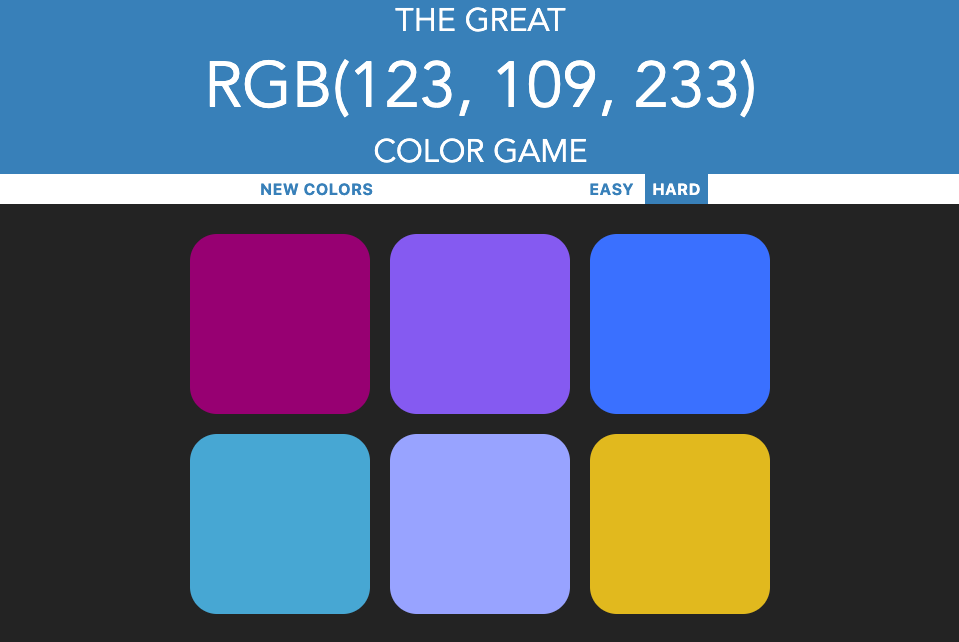
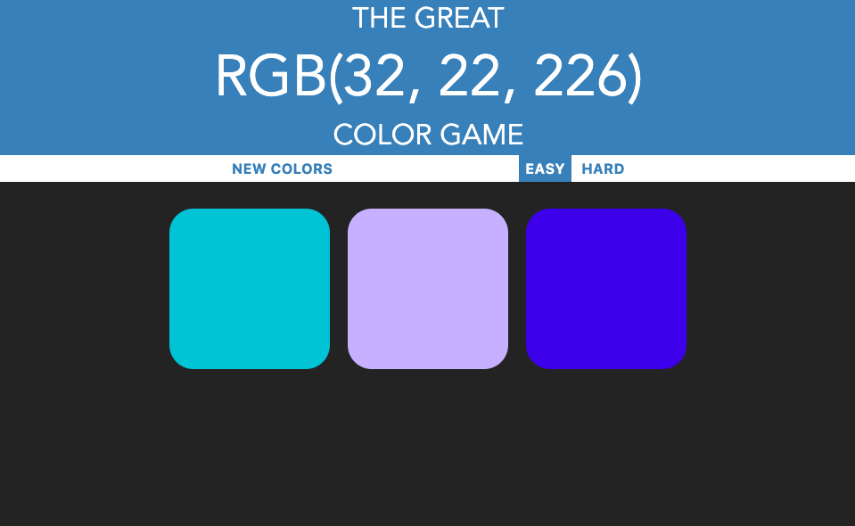
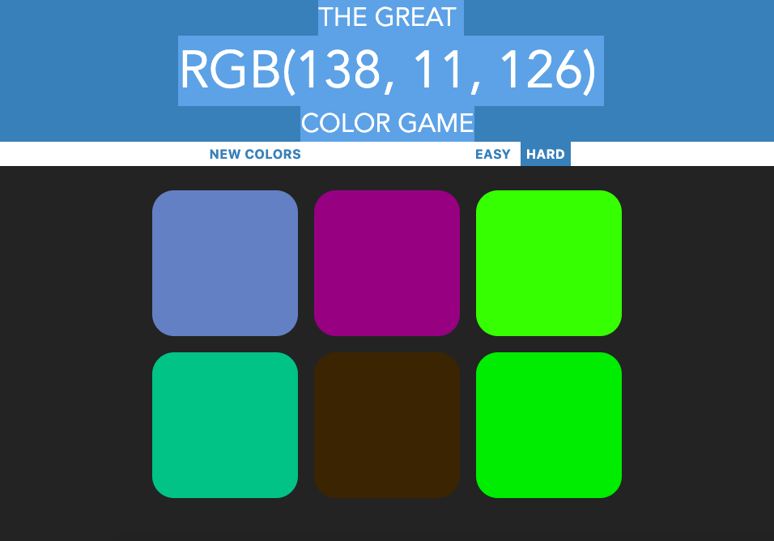
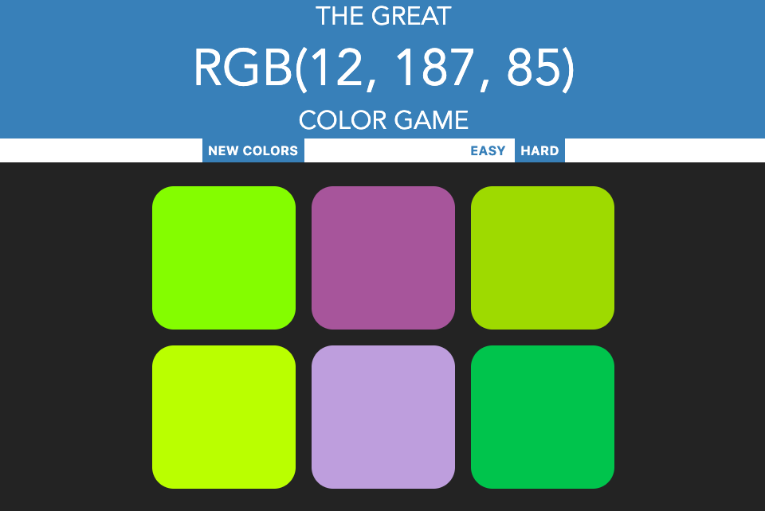
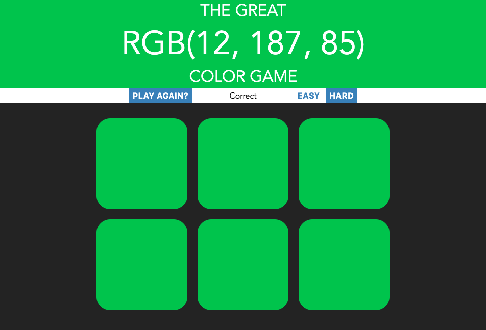

# RGB-Game

This is a RGB Game application, built using HTML, CSS and javaScript.

## How to play:

**1. Click [RGB Guessing Game](https://tiurzm.github.io/RGB-Game/)**

**2. Choose level difficulty.**

**3. Guess the color according to the corresponding numbers.** 

**4. Click NEW COLORS to get a new set of colors and numbers.**

**5. Click PLAY AGAIAN to reset the game.** 

